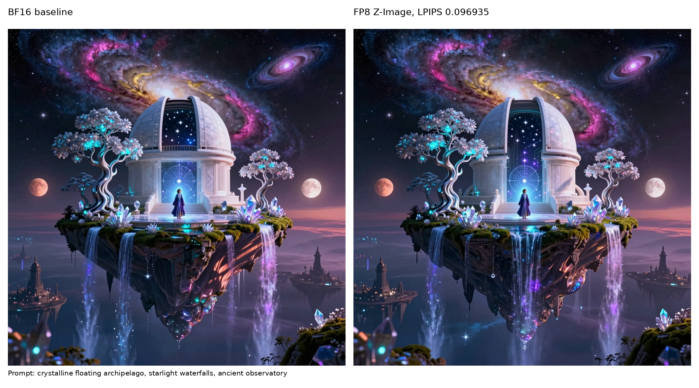
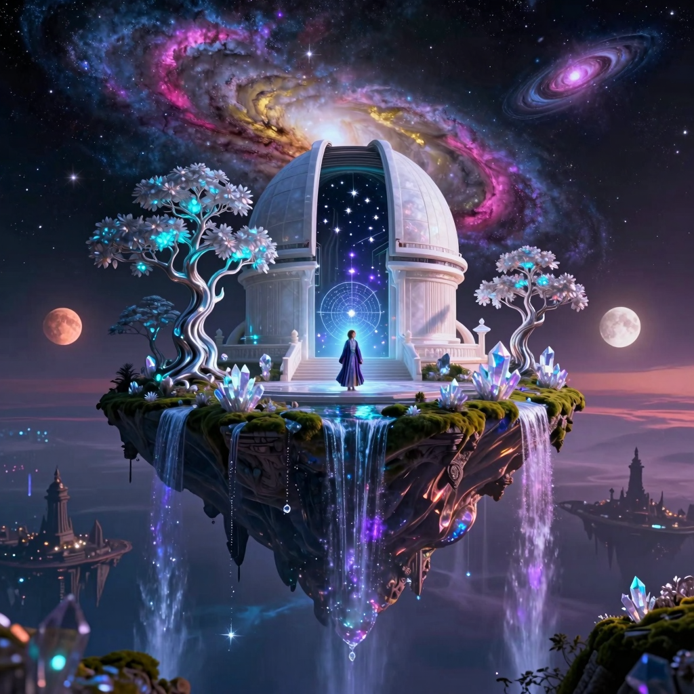

# FP8 Z-Image Quality Artifact

Generated by:

```bash
CUDA_VISIBLE_DEVICES=0 \
VLLM_OMNI_QUALITY_OUTPUT_DIR=$PWD/tests/diffusion/quantization/artifacts/fp8_z_image_quality \
.venv/bin/python -m pytest \
  tests/diffusion/quantization/test_quantization_quality.py::test_quantization_quality[fp8_z_image] \
  -s -v -m ""
```

Quantized config:

```python
{
    "transformer": {
        "method": "fp8",
        "ignored_layers": [
            "img_mlp",
            "layers.15..29.{attention.to_qkv,attention.to_out.0,feed_forward.w13,feed_forward.w2}",
        ],
    },
    "default": None,
}
```

Result: passed with `max_lpips=0.10`.

| Metric | Value |
|--------|-------|
| LPIPS | 0.096935 |
| PSNR | 21.893253 dB |
| MAE | 0.037334 |

Timing from the scan run for this config: BF16 `2.297244s`, FP8 `2.062006s`
(`0.8976x` of BF16 generation time).

## Comparison



## Individual Outputs



